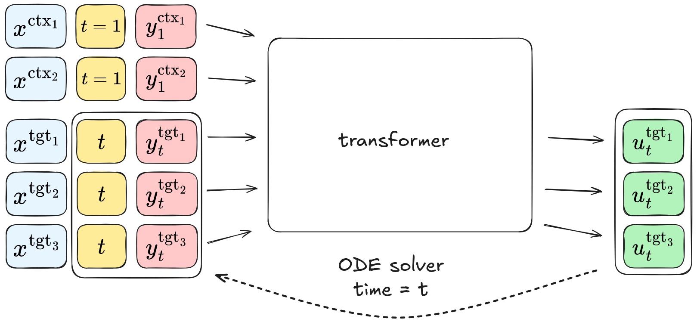

# Flow Matching Neural Processes

A neural process model based on flow matching. Official implementation of the NeurIPS 2025 paper [[OpenReview](https://openreview.net/forum?id=R8n2h7hzqS)].



## Installation

This project uses **pixi** to manage its dependencies and create a fully reproducible environment.

### 1. Clone the Repository

First, clone the repository:

```
git clone https://github.com/danrsm/flownp.git
```

### 2. Install pixi

You'll need to install **pixi** on your system. You can generally do this with the following command (check the [official documentation](https://pixi.sh/) for platform-specific instructions):

```bash
curl -Ls https://pixi.sh/install.sh | bash
```


### 3. Set up the project environment

Once you are inside the project main directory, run:

```
pixi install
```

## Running the code

First setup the data path and output path in `utils/paths.py`.

If you run on a GPU platform , use the `-e gpu` flag, otherwise remove it. 

For a quick start that trains and evaluates flowNP on 1D GP data (see below), run:

```
pixi run -e gpu start
```

---

## 1D GP data

### Training
```
pixi run -e gpu python gp.py --kernel=rbf --expname=test --expid=1 --model=fnp
```
The config of hyperparameters of each model is saved in `configs/gp`. If training for the first time, evaluation data will be generated and saved in `{output_path}/evalsets/gp`. Model weights and logs are saved in `{output_path}/results/gp/{model}/{expid}`.

Note that if you change something that affects the evaulation set you would need to delete the file saved in the `evalsets` directory to actually generate a new evaulation set. 


### Evaluation

Evaluation is run as part of training but in order perform evluation on a pre-trained model run:
```
pixi run -e gpu python gp.py --mode=eval --expname=test --expid=1 --model=fnp
```
Note that you have to specify `{expname}` and `{expid}` correctly so the model can load weights from `{output_path}/results/gp/{expname}/{kernel}{model}/{expid}` to evaluate.

Alternatively you can specify a checkpoint file with the flag `--ckptfile`.

You can also evaluate on a different evaluation set then the one generated/used in training using the flag `--evalfile`.

### Plotting 
Plotting is performed as part of evaluation, but in order to perform only plotting, run:
```
pixi run -e gpu python gp.py --mode=plot --expname=test --expid=1 --model=fnp
```


## EMNIST Image Completion


### Training
```
pixi run -e gpu python emnist.py --mode=train --expid=default --model=fnp
```
If training for the first time, EMNIST training data will automatically downloaded and saved in `{datasets_path}/emnist`.

### Evaluation
```
pixi run -e gpu python emnist.py --mode=evaluate_all_metrics --expid=default --model=fnp
```
If evaluating for the first time, evaluation data will be generated and saved in `{output_path}/evalsets/emnist`.


## CelebA Image Completion


### Prepare data
Download [img_align_celeba.zip](https://drive.google.com/drive/folders/0B7EVK8r0v71pTUZsaXdaSnZBZzg) and unzip. Download [list_eval_partitions.txt](https://drive.google.com/drive/folders/0B7EVK8r0v71pdjI3dmwtNm5jRkE) and [identity_CelebA.txt](https://drive.google.com/drive/folders/0B7EVK8r0v71pOC0wOVZlQnFfaGs). Place downloaded files in `{datasets_path}/celeba` folder. Run `python data/celeba.py` to preprocess the data.

### Training
```
pixi run -e gpu python celeba.py --mode=train --expid=default --model=fnp
```

### Evaluation
```
pixi run -e gpu python celeba.py --mode=eval --expid=default --model=fnp
```
If evaluating for the first time, evaluation data will be generated and saved in `{output_path}/evalsets/celeba`.

---

## Citation

If you find this repo useful in your research, please consider citing our paper:
```
@inproceedings{
hamad2025flow,
title={Flow Matching Neural Processes},
author={Hussen Abu Hamad and Dan Rosenbaum},
booktitle={The Thirty-ninth Annual Conference on Neural Information Processing Systems},
year={2025},
url={https://openreview.net/forum?id=R8n2h7hzqS}
}
```

## Acknowledgement

The implementation and baseline models are borrowed from the official code base of [Bootstrapping Neural Processes](https://github.com/juho-lee/bnp) and [Transformer Neural Processes](https://github.com/tung-nd/TNP-pytorch)
